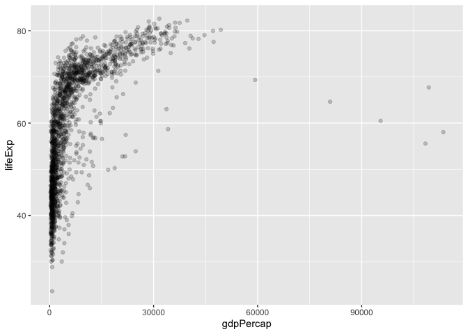

# Class 5: Data visualization with ggplot
Winnie (A16673200)

- [A more complicated scatter plot](#a-more-complicated-scatter-plot)
- [Exploring the gapminder dataset](#exploring-the-gapminder-dataset)

Today we will have our first play with the **ggplot2** package - one of
the most popular graphics packages on the planet.

There are many plotting systems in R. These include so-called *“base”*
plotting/graphics.

``` r
plot(cars)
```


Base plot is generally rather short code and somewhat dull plots - but
it is always there for you and is fast for big datasets.

If I want to use **ggplot2** it takes some more work.

``` r
# ggplot(cars)
```

I need to install the package first to my computer. To do this I can use
the function `install.packages("ggplot2")`

Every time I want to use a package I need to load it up with a
‘library()’ call.

``` r
library(ggplot2)
```

Now I finally can use ggplot

``` r
ggplot(cars)
```


Every ggplot has at least 3 things:

- **data** (the data.frame with the data you want to plot)
- **aes** (the aesthetic mapping of the data to the plot)
- **geom** (how do you want the plot to look, points, lines, etc.)

``` r
head(cars)
```

      speed dist
    1     4    2
    2     4   10
    3     7    4
    4     7   22
    5     8   16
    6     9   10

First point plot of cars

``` r
ggplot(cars) +
  aes(x=speed, y=dist) +
  geom_point() 
```


``` r
ggplot(cars) +
  aes(x=speed, y=dist) +
  geom_point() +
  geom_smooth()
```

    `geom_smooth()` using method = 'loess' and formula = 'y ~ x'


I want a linear model and no standard error bounds shown on my plot. I
also want a nicer axis labels a title etc.

``` r
bp <- ggplot(cars) +
  aes(x=speed, y=dist) +
  geom_point() 
```

``` r
bp + geom_smooth(se=FALSE, method="lm") +
  labs(title="Stopping Distance of Old Cars", 
       x="Speed (MPH)", 
       y="Distance (ft)",
       caption="From the cars dataset") +
  theme_bw()
```

    `geom_smooth()` using formula = 'y ~ x'


## A more complicated scatter plot

Here we make a plot of gene expression data:

``` r
url <- "https://bioboot.github.io/bimm143_S20/class-material/up_down_expression.txt"
genes <- read.delim(url)
head(genes)
```

            Gene Condition1 Condition2      State
    1      A4GNT -3.6808610 -3.4401355 unchanging
    2       AAAS  4.5479580  4.3864126 unchanging
    3      AASDH  3.7190695  3.4787276 unchanging
    4       AATF  5.0784720  5.0151916 unchanging
    5       AATK  0.4711421  0.5598642 unchanging
    6 AB015752.4 -3.6808610 -3.5921390 unchanging

> Q. Use the nrow() function to find out how many genes are in this
> dataset. What is your answer?

``` r
nrow(genes)
```

    [1] 5196

> Q. Use the colnames() function and the ncol() function on the genes
> data frame to find out what the column names are (we will need these
> later) and how many columns there are. How many columns did you find?

``` r
colnames(genes)
```

    [1] "Gene"       "Condition1" "Condition2" "State"     

``` r
ncol(genes)
```

    [1] 4

> Q. Use the table() function on the State column of this data.frame to
> find out how many ‘up’ regulated genes there are. What is your answer?

``` r
table(genes$State)
```


          down unchanging         up 
            72       4997        127 

> Q. Using your values above and 2 significant figures. What fraction of
> total genes is up-regulated in this dataset?

``` r
round(sum(genes$State == "up")/nrow(genes)*100, 2)
```

    [1] 2.44

``` r
n.gene <- nrow(genes)
n.up <- sum(genes$State == "up")

up.precent <- n.up/n.gene * 100
round(up.precent, 2)
```

    [1] 2.44

``` r
head(genes, 2)
```

       Gene Condition1 Condition2      State
    1 A4GNT  -3.680861  -3.440135 unchanging
    2  AAAS   4.547958   4.386413 unchanging

``` r
library(ggplot2)
```

``` r
ggplot(genes) +
  aes(x=Condition1, y=Condition2, col=State) +
  geom_point()
```


``` r
p <- ggplot(genes) + 
    aes(x=Condition1, y=Condition2, col=State) +
    geom_point()
p
```


Change the colors

``` r
p + labs(title="Gene Expression Changes Upon Drug Treatment",
         x="Control (no drug)",
         y="Drug Treatment") +
  scale_color_manual(values=c("purple","green","pink"))
```


## Exploring the gapminder dataset

Here we will load up the gapminder dataset to get practice with
different aes

``` r
url <- "https://raw.githubusercontent.com/jennybc/gapminder/master/inst/extdata/gapminder.tsv"

gapminder <- read.delim(url)
```

> Q. How many entries rows are in this dataset?

``` r
nrow(gapminder)
```

    [1] 1704

> Q. How many columns are in this dataset?

``` r
ncol(gapminder)
```

    [1] 6

``` r
head(gapminder)
```

          country continent year lifeExp      pop gdpPercap
    1 Afghanistan      Asia 1952  28.801  8425333  779.4453
    2 Afghanistan      Asia 1957  30.332  9240934  820.8530
    3 Afghanistan      Asia 1962  31.997 10267083  853.1007
    4 Afghanistan      Asia 1967  34.020 11537966  836.1971
    5 Afghanistan      Asia 1972  36.088 13079460  739.9811
    6 Afghanistan      Asia 1977  38.438 14880372  786.1134

``` r
table(gapminder$year)
```


    1952 1957 1962 1967 1972 1977 1982 1987 1992 1997 2002 2007 
     142  142  142  142  142  142  142  142  142  142  142  142 

> Q. How many continents?

``` r
table(gapminder$continent)
```


      Africa Americas     Asia   Europe  Oceania 
         624      300      396      360       24 

I could use the `unique()` function…

``` r
unique(gapminder$continent)
```

    [1] "Asia"     "Europe"   "Africa"   "Americas" "Oceania" 

``` r
length(unique(gapminder$continent))
```

    [1] 5

> Q. How many countries are there in this dataset?

``` r
length(unique(gapminder$country))
```

    [1] 142

``` r
ggplot(gapminder) +
  aes(x=gdpPercap, y=lifeExp) +
  geom_point(alpha=0.2)
```



``` r
ggplot(gapminder) +
  aes(x=gdpPercap, y=lifeExp, col=continent, size=pop) +
  geom_point(alpha=0.5)
```


``` r
library(dplyr)
```


    Attaching package: 'dplyr'

    The following objects are masked from 'package:stats':

        filter, lag

    The following objects are masked from 'package:base':

        intersect, setdiff, setequal, union

I need to install dplyr

``` r
# install.packages("dplyr")  ## un-comment to install if needed
library(dplyr)

gapminder_2007 <- gapminder %>% filter(year==2007)
```

Plot of 2007 gapminder

``` r
ggplot(gapminder_2007) +
  aes(x=gdpPercap, y=lifeExp) +
  geom_point(alpha=0.5)
```


More aes

``` r
ggplot(gapminder_2007) +
  aes(x=gdpPercap, y=lifeExp, color=continent, size=pop) +
  geom_point(alpha=0.5)
```


``` r
ggplot(gapminder) + 
  aes(x = gdpPercap, y = lifeExp) + 
  geom_point() +
  facet_wrap(~continent)
```


``` r
ggplot(mtcars) + 
  aes(x=mpg, y=disp) + 
  geom_point()
```


``` r
ggplot(mtcars, 
       aes(mpg, disp)) +
  geom_point()
```


